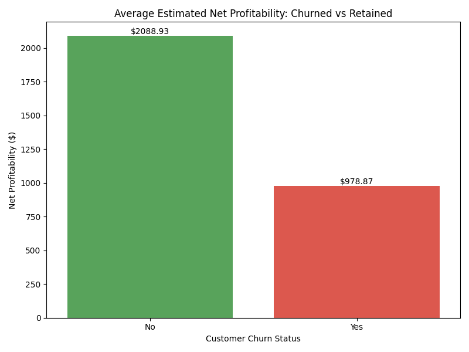
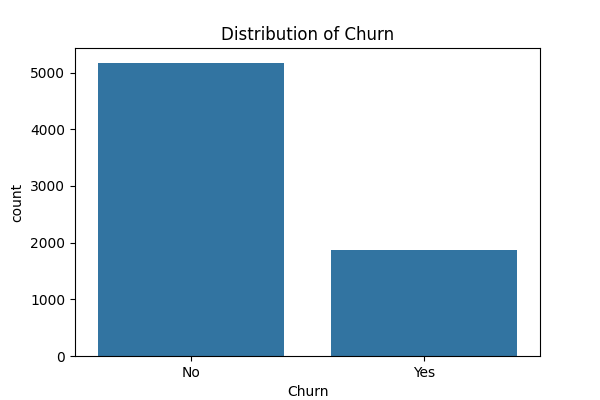
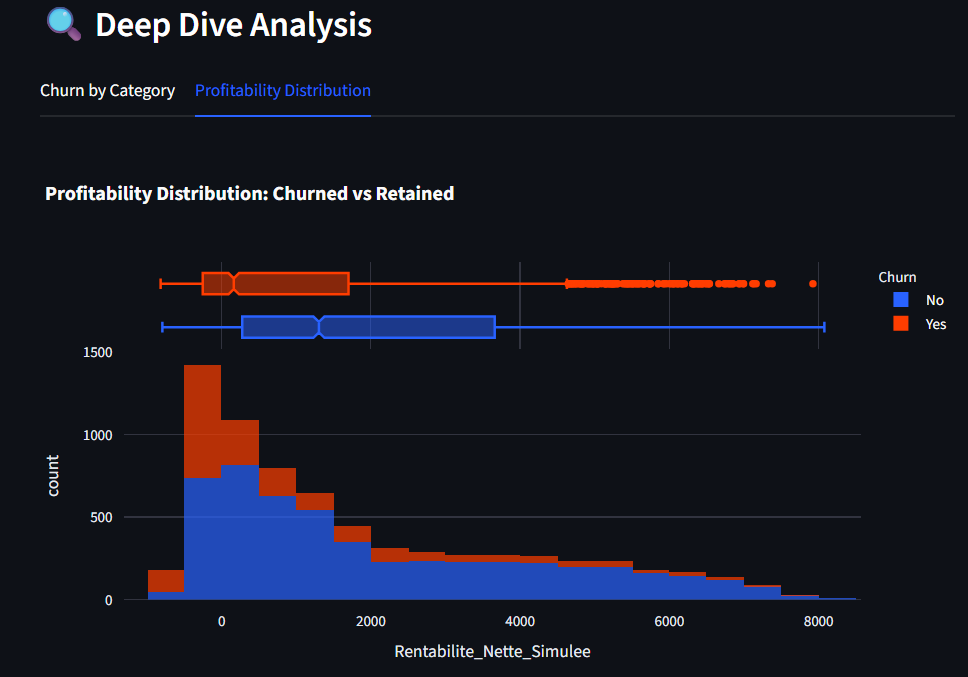
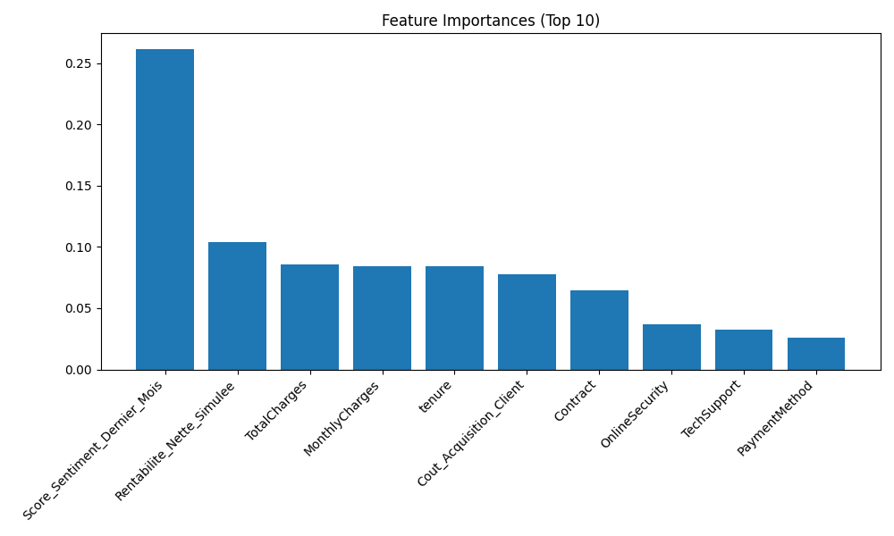

# 🧠 Data-Driven Customer Retention Strategy: Predicting & Preventing Churn

<div align="center">
  
</div>

<div align="center">
  <h3>🔴 Live Demo: <a href="https://mouadbakhchane-data-portfolio-dashboard-t8mqrg.streamlit.app/">Launch Dashboard App</a></h3>
</div>

<div align="center">
  
</div>

## 📌 Project Background: The "Silent Churn" Crisis
**"We are losing customers faster than we can acquire them, and we don't know why."**

This is the problem statement that kicked off this project. A major telecommunications provider approached me with a critical business challenge: their Churn Rate had spiked to **26.5%**, and standard retention strategies (generic emails, small discounts) were failing. They needed a **Data Science solution** to stop the bleeding.

They didn't just want a "prediction model"; they wanted a **strategy**.

### 🛠️ The Solution Process
To tackle this, I implemented a structured Data Science lifecycle:
1.  **Data Archaeology:** I started by digging into their raw data (7,043 customer records) to understand the "DNA" of a lost customer.
2.  **Feature Engineering:** I created new metrics like `Profitability` and `Sentiment Score` to add depth to the analysis.
3.  **Predictive Modeling:** I built a Machine Learning model (Random Forest) that doesn't just guess *who* will leave, but explains *why*.
4.  **Operational Dashboard:** I delivered a deployable tool for their sales team to test "Retention Offers" before picking up the phone.

---

## 📊 Visual Analysis & Findings

### 1. The Churn Landscape
<div align="center">
  
  
</div>

*   **Churn Distribution (Left):** We observe a baseline Churn Rate of **26.5%**. This seemingly manageable number is deceptive because it hides the *value* of the customers leaving.
*   **Profitability by Churn Status (Right):** This is the most alarming insight.
    *   The **Green Bar** (Retained Customers) shows a significantly higher average Net Profitability (~$2100).
    *   The **Red Bar** (Churned Customers) shows that we are losing customers who are *also* profitable (~$970), but importantly, the gap indicates that our most loyal customers are our cash cows.
    *   **Strategic Takeaway:** We cannot afford to lose the "Whales" (High Profitability customers). A 5% reduction in churn here could double the net profit margin.

### 2. Deep Dive: Profitability Distribution (Box Plot & Histogram)
<div align="center">
  
</div>

The dashboard's **Profitability Distribution** graph (shown above) reveals a critical nuance:
*   **The Overlap:** While the median profitability of churned customers (Orange Box) is lower than retained ones (Blue Box), there is a significant **"Red Tail"** extending to the right.
*   **The "Leaking Bucket" Phenomenon:** The histogram shows we are actively losing customers with profitability > $4,000. These are not just "users"; they are "subscribers" who likely generate 80% of the margin.
*   **Action:** The standard retention policy treats a $50/month user the same as a $4,000 profit user. The model allows us to segment this "Red Tail" for VIP treatment.

---

## 🤖 Feature Importance: The "Signal" vs. The "Noise"

We trained a powerful Random Forest model to rank the predictors of churn.

<div align="center">
  
</div>

**Why do we highlight `Sentiment` and `Profitability` if `Total Charges` is the top predictor?**

1.  **Total Charges & Tenure (The "What"):** These are statistically the strongest because they are proxies for "Relationship Depth." A customer paying $0 Total Charges is brand new and volatile. A customer with $5000 Total Charges is loyal. While predictive, **you cannot change a customer's past charges.**
2.  **Contract Type (The "Lock"):** This is a structural barrier. Month-to-month customers are free to leave, making them inherently risky.
3.  **Rentabilite_Nette_Simulee (The "Value"):** We display this prominently because it dictates **Priority**. A high-risk customer worth $10 is low priority. A medium-risk customer worth $5000 is useful.
4.  **Score_Sentiment_Dernier_Mois (The "Why"):** *This is the most actionable feature.* Unlike "Contract" (which is hard to change) or "Tenure" (which takes time), Sentiment is a **Leading Indicator**. A drop in sentiment score happens *weeks* before a cancellation. **If we fix the sentiment, we save the customer.**

---

## 💻 The Analysis Dashboard
To make these insights accessible to stakeholders, we built a dynamic **Streamlit Dashboard**.

### Key Capabilities:
*   **Real-Time Churn Simulator:** A "What-If" engine allowing managers to adjust customer parameters (e.g., *"If we offer a discount reducing their bill by $10, does their risk drop?"*).
*   **Dynamic Segmentation:** The dashboard allows filtering churn risk by **Internet Service** (Fiber vs DSL) and **Payment Method** to pinpoint friction points.
*   **Financial Quantifier:** Automatically calculates the `Total Revenue at Risk` based on the currently selected segment.

---

## 💡 Strategic Recommendations

Based on our data-driven findings, we propose a three-tiered retention strategy:

### 🥇 Tier 1: The "High-Value Savior" Program
*   **Target:** Customers with `Rentabilite_Nette_Simulee > $2000` AND `Churn Probability > 60%`.
*   **Action:** Immediate "White Glove" outreach. Do not send automated emails. Assign a dedicated account manager to resolve their specific complaints (indicated by low `Sentiment`).
*   **Rationale:** Saving one of these customers pays for the retention of 10 average customers.

### 🥈 Tier 2: The "Contract Migration" Campaign
*   **Target:** Customers on `Month-to-Month` contracts with `Tenure < 12 Months`.
*   **Action:** Offer a **"12th Month Free"** promotion in exchange for signing a 1-Year Contract.
*   **Rationale:** The data shows that once a customer passes the 12-month mark (and enters a contract), their churn probability drops by over 40%. The cost of the free month is far less than the Acquisition Cost of replacing them.

### 🥉 Tier 3: Tech-Touch Sentiment Calibration
*   **Target:** Customers with `Score_Sentiment` dropping below `0.0` (Neutral).
*   **Action:** Automated trigger to Customer Support to review recent tickets. Send a generic "We're sorry" digital gift card ($5).
*   **Rationale:** Low-cost, automated intervention to bump sentiment back into the positive range before they consider leaving.

---

## 🚀 How to Run this Project

1.  **Clone the repository**
    ```bash
    git clone https://github.com/MouadBAKHCHANE/data-portfolio.git
    cd data-portfolio
    ```

2.  **Install Dependencies**
    ```bash
    pip install pandas numpy matplotlib seaborn scikit-learn streamlit joblib
    ```

3.  **Run the Analysis & Model**
    ```bash
    python analyze_dataset.py  # Generates EDA report
    python train_model.py      # Trains model & saves metrics
    python profitability_analysis.py # Generates business plots
    ```

4.  **Launch the Dashboard**
    ```bash
    streamlit run dashboard.py
    ```

---
*Author: Mouad Bakhchane*
