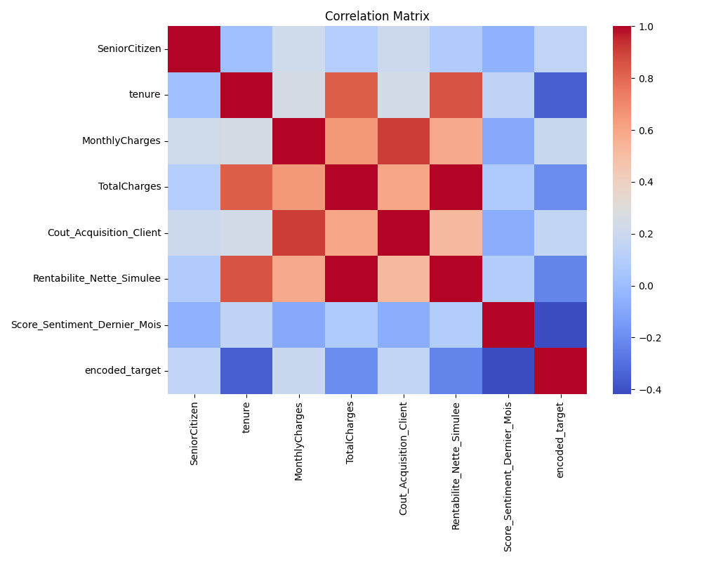

# Analysis of Telco_Churn_Enrichi_GCP.csv

## 1. Dataset Overview
- **Rows:** 7043
- **Columns:** 24

### Columns:
`customerID`, `gender`, `SeniorCitizen`, `Partner`, `Dependents`, `tenure`, `PhoneService`, `MultipleLines`, `InternetService`, `OnlineSecurity`, `OnlineBackup`, `DeviceProtection`, `TechSupport`, `StreamingTV`, `StreamingMovies`, `Contract`, `PaperlessBilling`, `PaymentMethod`, `MonthlyCharges`, `TotalCharges`, `Churn`, `Cout_Acquisition_Client`, `Rentabilite_Nette_Simulee`, `Score_Sentiment_Dernier_Mois`

## 2. Data Quality
No missing values found.

**Duplicate Rows:** 0

## 3. Target Variable Analysis (Churn)
| Value | Count | Percentage |
|---|---|---|
| No | 5174 | 73.46% |
| Yes | 1869 | 26.54% |

## 4. Numeric Features Summary
                               count         mean          std         min         25%          50%          75%          max
SeniorCitizen                 7043.0     0.162147     0.368612    0.000000    0.000000     0.000000     0.000000     1.000000
tenure                        7043.0    32.371149    24.559481    0.000000    9.000000    29.000000    55.000000    72.000000
MonthlyCharges                7043.0    64.761692    30.090047   18.250000   35.500000    70.350000    89.850000   118.750000
TotalCharges                  7043.0  2279.734304  2266.794470    0.000000  398.550000  1394.550000  3786.600000  8684.800000
Cout_Acquisition_Client       7043.0   485.383158   247.956863   96.868026  250.009739   490.569095   669.634272  1163.610237
Rentabilite_Nette_Simulee     7043.0  1794.351145  2128.252894 -817.375679   56.903589  1021.577470  3198.974474  8077.446231
Score_Sentiment_Dernier_Mois  7043.0     0.132814     0.477157   -1.000000   -0.240000     0.130000     0.510000     1.000000

## 5. Correlations
### Top Correlations:
| Feature 1 | Feature 2 | Correlation |
|---|---|---|
| TotalCharges | Rentabilite_Nette_Simulee | 0.9956 |
| Cout_Acquisition_Client | MonthlyCharges | 0.9085 |
| tenure | Rentabilite_Nette_Simulee | 0.8530 |
| TotalCharges | tenure | 0.8262 |
| MonthlyCharges | TotalCharges | 0.6512 |
| Cout_Acquisition_Client | TotalCharges | 0.5964 |
| MonthlyCharges | Rentabilite_Nette_Simulee | 0.5877 |
| Cout_Acquisition_Client | Rentabilite_Nette_Simulee | 0.5187 |
| MonthlyCharges | tenure | 0.2479 |
| Cout_Acquisition_Client | tenure | 0.2313 |

